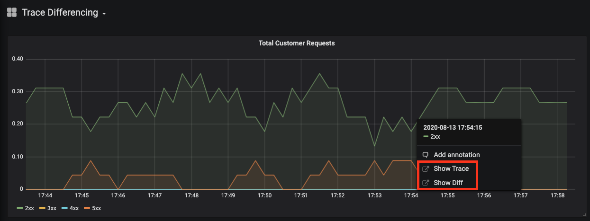

# From Alert Notification to Comparison of Good and Bad Requests in One Click

This is a working demo that accompanies the talk [From Alert Notification to Comparison of Good and Bad Requests in One Click] from KubeCon EU 2020's Observability track.

It shows OpenMetrics exporting metrics and exemplar trace IDs, then metrics and exemplars being scraped by Prometheus, forwarded to M3 where exemplars and metrics live in long term storage, and the ability to click on a datapoint in any graph in Grafana and jump straight to the exemplar trace associated with that datapoint. Additionally, it provides the ability to compare a bad trace with a good trace.

All the forked sources and changes are present under https://github.com/chronosphereiox

## Prerequisites

- NodeJS 10.xx
- Go 1.13
- GNU tar (Prometheus requires GNU-tar for building)

The demo checks out the required repositories as sub-modules, builds the docker images and launches
them. Use the following command to start the demo.
```bash
make start
```
This will take a while to build as it is building
grafana, prometheus, m3 and a couple of other things.

The `make start` command above will start the demo AND build the Docker images.

Once the images are built, you can use the following commands to start and stop the demo.

```bash
make app_start # starts the demo

make app_stop # stops the demo
```

Once the demo is up, navigate to http://localhost:8080/ to enable traffic through the demo Jaeger app HotRod
and have the application emit traces and metrics.

The demo automatically provisions an [M3Query] data source and a sample Grafana dashboard that shows 
a request success/failure metric with traces linked to individual datapoints if present. Grafana is
available at http://localhost:3000/ and can be logged in with the following credentials:

username: `admin`
password: `admin`

The dashboard that gets preloaded is called `Trace Differencing`.

When you click on a datapoint in the series, it shows you a `Show Diff` button that will take you to a trace
difference view between a good and a bad trace (see screenshot below). Additionally, if there is an associated trace, the `Show Trace`
button will take you to the Jaeger view of that specific trace and span.

**Note:** the `Show Diff` feature is only available on the following graphs:

1. Total Customer Requests
2. Request Latency Histogram



[From Alert Notification to Comparison of Good and Bad Requests in One Click]: https://kccnceu20.sched.com/event/Zeoq/from-alert-notification-to-comparison-of-good-and-bad-requests-in-one-click-shreyas-srivatsan-mantas-klasavicius-chronosphere
[M3Query]: https://docs.m3db.io/
